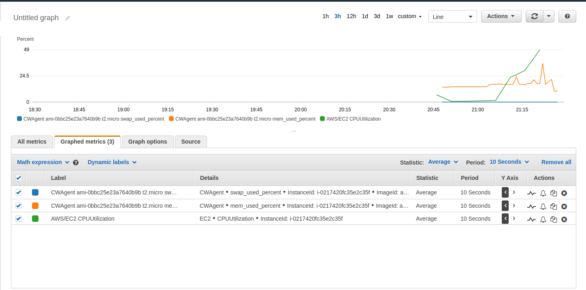

## Praca domowa tydzień 3

ClowdWatch nie monitoruje pamięci RAM w EC2.

Rozwiązaniem problemu, jest instalacja CloudWatch agent-a.

#### PoC

Testowo do instalacji CloudWatch agent-a, wykorzystałem standardowy template ClaudFormation (ami linux + instalacja agenta).

```
https://raw.githubusercontent.com/awslabs/aws-cloudformation-templates/master/aws/solutions/AmazonCloudWatchAgent/ssm/amazon_linux.template
```

